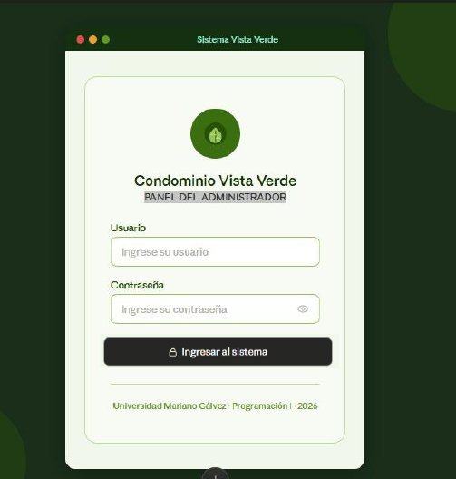
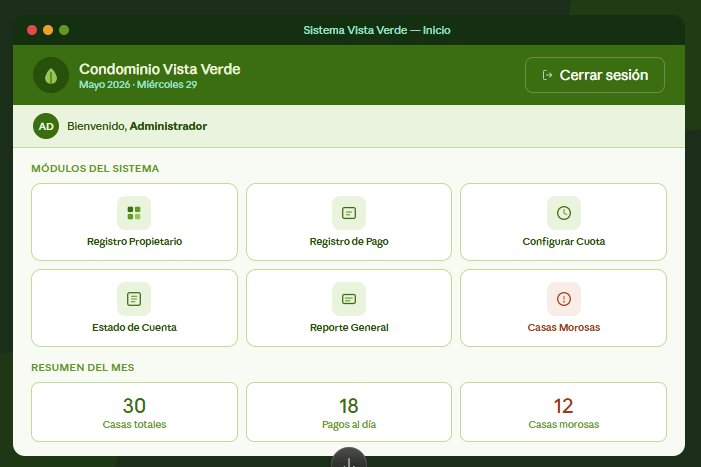
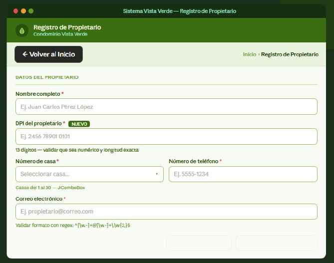
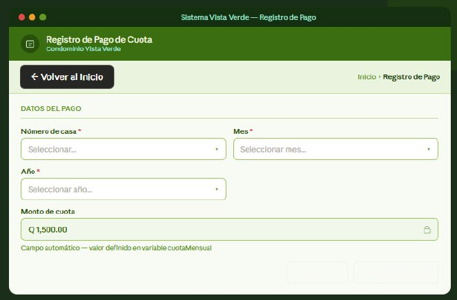
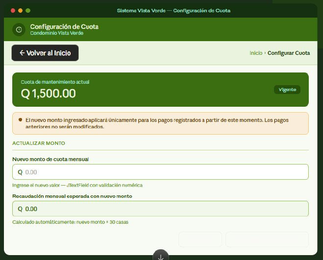
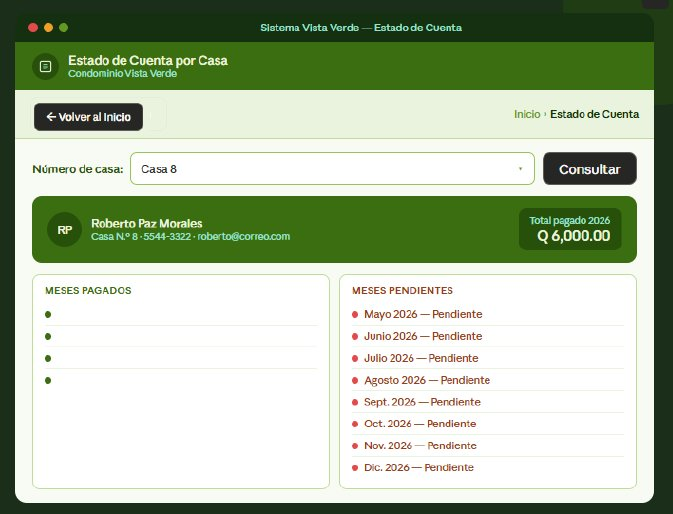
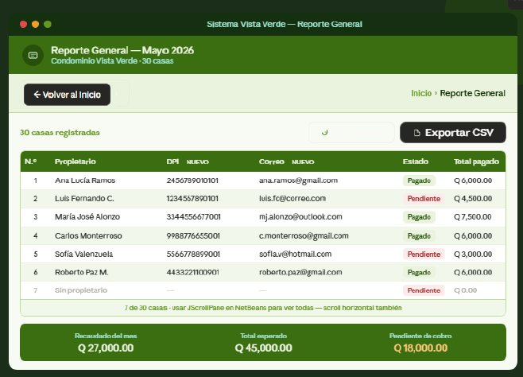
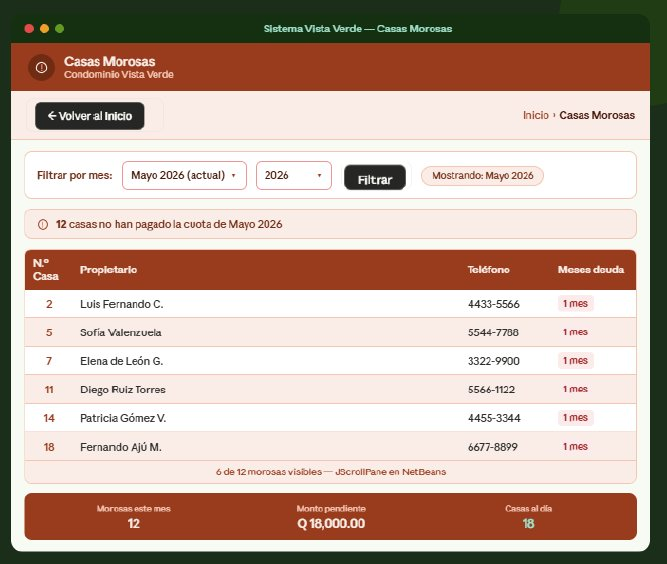

# 🏢 Sistema de Administración - Condominio Vista Verde


---

**Descripción:** Aplicación de escritorio desarrollada en Java Swing para la gestión integral del Condominio Vista Verde. El sistema permite administrar propietarios, controlar el registro de casas, llevar el seguimiento de las cuotas de mantenimiento mensuales, registrar pagos, generar reportes generales y detectar casas morosas.

> Proyecto Final — Programación I, Universidad Mariano Gálvez de Guatemala, 2026.

---

## 👥 Equipo de Desarrollo

| Nombre Completo | Carné | Rol en el Equipo |
|---|---|---|
| JOSUE SEBASTIAN AMBROCIO ALVARADO | 0900-25-9639 | Scrum Master / QA |
| ELENA VALESKA TOYÓN DE LEÓN | 0900-25-18392 | DEV |
| ADOLFO GONZÁLEZ GREGORIO | 0900-25-28528 | DEV / QA |
| JORGE MARIO CASTRO CORDON | 0900-25-29602 | DEV |
| YEIMY YOANNA HERNÁNDEZ URBINA | 0900-25-19441 | DEV |

---

## 🛠️ Tecnologías y Versiones

- **Java JDK:** 26
- **IDE:** Apache NetBeans 29
- **Base de datos:** PostgreSQL 18.3
- **Herramienta de compilación:** Apache Maven
- **Control de versiones:** Git & GitHub

---

## ⚙️ Instrucciones de Ejecución

Para ejecutar este proyecto en cualquier entorno local, sigue estos pasos:

### 1. Requisitos Previos

- Instalar [Java JDK 26](https://jdk.java.net/)
- Instalar [Apache NetBeans 29](https://netbeans.apache.org/)
- Instalar [PostgreSQL 18.3](https://www.postgresql.org/download/)
- Instalar [Apache Maven](https://maven.apache.org/)

### 2. Clonar el Repositorio

```bash
git clone https://github.com/jambrocio-dev17/sistema-condominio-vista-verde.git
```

### 3. Configurar la Base de Datos

- Crear una base de datos en PostgreSQL con el nombre: `condominio_vista_verde`
- Ejecutar el script SQL ubicado en la carpeta `/database/` (si aplica)
- Configurar las credenciales de conexión en el archivo `Conexion.java` dentro del paquete `configuration`

### 4. Ejecutar el Proyecto

- Abrir el proyecto en Apache NetBeans 29
- Haz clic derecho sobre el proyecto
- Selecciona **Run** o **Clean and Build**

---

## 📸 Capturas del Sistema

| Pantalla 1 | Pantalla 2 | Pantalla 3 | Pantalla 4 |
|---|---|---|---|
|  |  |  |  |
| **Login** | **Menú Principal** | **Registro Propietario** | **Registro de Pago** |

| Pantalla 5 | Pantalla 6 | Pantalla 7 | Pantalla 8 |
|---|---|---|---|
|  |  |  |  |
| **Configurar Cuota** | **Estado de Cuenta** | **Reporte General** | **Casas Morosas** |

---

## 📋 Tablero de Jira

🔗 [Ver tablero del proyecto en Jira](https://umg-proyectofinal-p1.atlassian.net/jira/software/projects/SCRUM/boards/1?atlOrigin=eyJpIjoiOTYzMjdmNDUxYjBmNDljMzgwZGM3Nzc4NzVmZDE5MzUiLCJwIjoiaiJ9)

---

## 📄 Licencia

Este proyecto fue desarrollado con fines académicos para la Universidad Mariano Gálvez de Guatemala.

---

<p align="center">
  <b>Condominio Vista Verde</b> · Sistema de Administración · 2026
</p>
